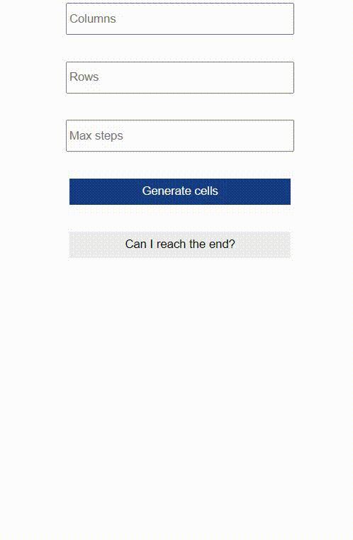

# ReachTheEndInTime

## Development server

Run `ng serve` for a dev server. Navigate to `http://localhost:4200/`. The app will automatically reload if you change any of the source files.

## Build

Run `ng build` to build the project. The build artifacts will be stored in the `dist/` directory. Use the `--prod` flag for a production build.
## Usage 

Enter an amount of column and rows to create a random maze, once generated you can click on each cell to toggle between a path "." or a wall "#".
Once the maze is done press the button "Can I reach the end?"

